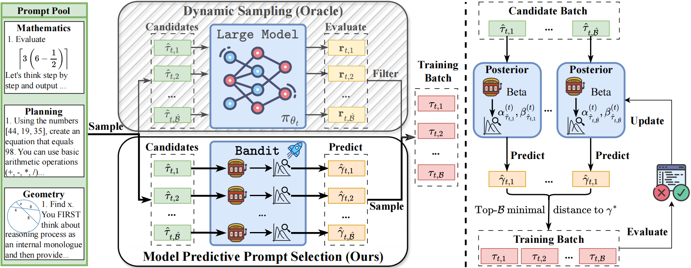

# MoPPS: Model Predictive Prompt Selection

<div align="center">

[](https://arxiv.org/abs/2507.04632)
[](https://www.thuidm.com/)
[](https://github.com/thu-rllab/MoPPS)

</div>

This repository contains code for **Model Predictive Prompt Selection (MoPPS)**, a framework for online predicting prompt difficulty to accelerate reinforcement learning (RL) finetuning of Large Reasoning Models.




## 🔧 Installation

Ensure you have **CUDA ≥ 12.4**, then run:

```bash
bash prepare.sh
```

This script installs all required packages and dependencies.

## 📦 Dataset Preparation

We support multiple reasoning tasks. Run the following scripts to preprocess each dataset:

```bash
# Mathematics dataset
python recipe/ours/data_preprocess/math_dataset.py --local_dir='./data/math'

# Mathematics Evaluation Benchmarks from deepscaler
python recipe/ours/data_preprocess/deepscaler/deepscaler_dataset.py --local_dir='./data/deepscaler'

# Countdown-34
python recipe/ours/data_preprocess/countdown.py --local_dir='./data/countdown3to4'

# Countdown-4
python recipe/ours/data_preprocess/countdown4.py --local_dir='./data/countdown4'

# Geometry3k
python recipe/ours/data_preprocess/geo3k.py --local_dir='./data/geo3k'
```

## 📥 Download Pretrained Models

You can download models from [Hugging Face](https://huggingface.co/) as follows (example shown with DeepSeek-R1-Distill-Qwen-1.5B):

```bash
huggingface-cli download --resume-download deepseek-ai/DeepSeek-R1-Distill-Qwen-1.5B --local-dir models/DeepSeek-R1-Distill-Qwen-1.5B
```

> Tip: You can change `--local-dir` to your own model path. Be sure to match it with your training configs.

## 🚀 Training

All training scripts are located in:

```
recipe/ours/scripts/
```

These include task-specific scripts for launching MoPPS and baseline methods with different backbones and datasets.

Below is an example of how to launch MoPPS training on the Countdown task with Qwen2.5-3B:


```
bash recipe/ours/scripts/countdown/cd_verl_3b_topk_noinit.sh
```


## 📚 Citation

If you find this work useful for your research, please cite our paper:

```bibtex
@article{qu2025can,
  title={Can Prompt Difficulty be Online Predicted for Accelerating RL Finetuning of Reasoning Models?},
  author={Qu, Yun and Wang, Qi and Mao, Yixiu and Hu, Vincent Tao and Ommer, Bj{\"o}rn and Ji, Xiangyang},
  journal={arXiv preprint arXiv:2507.04632},
  year={2025}
}
```
